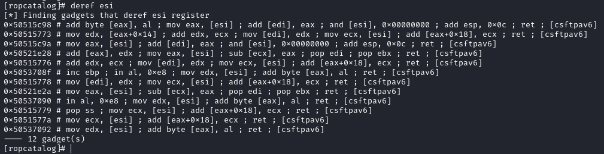

`ropcatalog` is a Python tool designed for parsing and analyzing [ROP (Return-Oriented Programming)](https://en.wikipedia.org/wiki/Return-oriented_programming) gadgets extracted from [rp++](https://github.com/0vercl0k/rp) output files. It helps identify, classify, and filter useful ROP gadgets.

```txt
usage: catalog [-h] [-b BAD_CHARACTERS] [-u] [-s {plain,python,js,cpp}] [-o] paths [paths ...]

r++ gadget parser for specific instructions.

positional arguments:
  paths                 Paths to one or more ROP files generated by r++. Directory also accepted.

options:
  -h, --help            show this help message and exit
  -b BAD_CHARACTERS, --bad-characters BAD_CHARACTERS
                        A string of characters to exclude in the format '\x00\x0a\x0d'.
  -u, --unique          Filter for unique gadgets by their raw instruction sequences.
  -s {plain,python,js,cpp}, --style {plain,python,js,cpp}
                        Output format style: plain, python, or js.
  -o, --offset          The file contains only the offset (e.g., ALSR case).
```

It was built during OffSec journey. Primarly for [EXP-301 course](https://www.offsec.com/courses/exp-301/) and then [EXP-401](https://www.offsec.com/courses/exp-401/). These courses focuses on Windows exploit development.

## Installation

Designed for simplicity, using `pipx` for isolation:

```shell
pipx install 'git+https://github.com/n3rada/ropcatalog.git'
```

Or with `uv`:
```
uv tool install 'git+https://github.com/n3rada/ropcatalog.git'
```

Then, you can use `ropcatalog` to help you leaf through the gadget catalog:
```shell
ropcatalog ~/dump/libeay32IBM019.txt
```

Or even directly with a folder containing multiple `rp++` output files:
```shell
ropcatalog.exe .\gadgets\ -o -u -s cpp
```

## Quickstart

Dump gadgets using `rp++`:

```shell
.\rp-win.exe -f "C:\Program Files\ibm\gsk8\lib\N\icc\osslib\libeay32IBM019.dll" --va=0 -r 5 > libeay32IBM019.txt
```
Then, open your catalog with ASLR considerations (`--offset`) and output unique (`-u`) addresses in a copy-pastable Python format (`-s`):
```shell
ropcatalog ~/dump/libeay32IBM019.txt -b "\x00\x09\x0a\x0b\x0c\x0d\x20" -u -o -s python
```

If you forgot how to browse your own catalog, use `help`

Now, you can search for any gadget that copies the stack pointer (`ESP`) register to another register:


Without offset considerations, you can search inside any module for gadgets that dereference `ESI`:




Without using the Python copy-paste format, you can search for gadgets that zero `EAX`:


