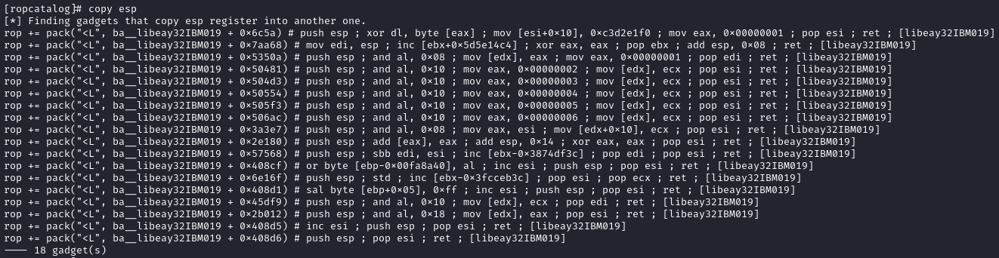
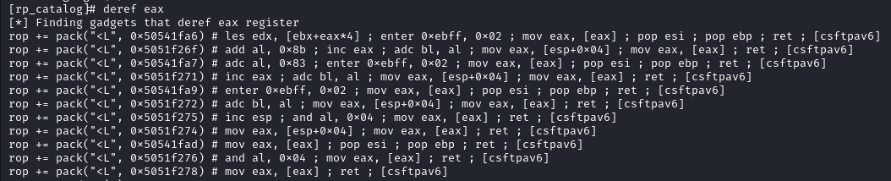
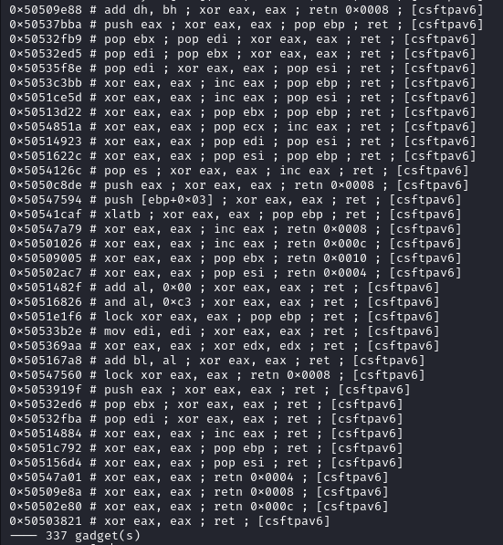

`rp_catalog` is a Python tool designed for parsing and analyzing ROP (Return-Oriented Programming) gadgets extracted from [rp++](https://github.com/0vercl0k/rp) output files. It helps identify, classify, and filter useful ROP gadgets with a primary focus on the x86 architecture.

It was built during the [EXP-301 course](https://www.offsec.com/courses/exp-301/), which focuses on exploit development. The tool is specifically tailored and designed for working with x86 ROP chains.

## Installation
Thought for simplicity:

```shell
pipx install 'git+https://github.com/n3rada/rp_catalog.git'
```

Or, without dependency conflicts:
```shell
pip install 'rp_catalog@git+https://github.com/n3rada/rp_catalog.git'
```

Then, you can directly use it by calling its name

```shell
rp_catalog ~/dump/libeay32IBM019.txt
```

## Examples

Generate the output with `rp++` as follows:
```shell
.\rp-win-x86.exe -f "C:\Program Files\ibm\gsk8\lib\N\icc\osslib\libeay32IBM019.dll" --va=0 -r 5 > libeay32IBM019.txt
```
Then, open your catalog with ASLR considerations (`--offset`) and output unique (`-u`) addresses in a copy-pastable Python format (`-p`):
```shell
rp_catalog ~/dump/libeay32IBM019.txt -b "\x00\x09\x0a\x0b\x0c\x0d\x20" -u -p -o
```

```txt
[+] Bad characters: ['00', '09', '0a', '0b', '0c', '0d', '20']
[*] Parsing libeay32IBM019.txt, looking for usable gadgets

[libeay32IBM019] Parsing completed:
[+] Total gadgets extracted: 57700
[+] Gadgets excluded: 3730
   |-> 1681 gadgets had large 'retn' values
   |-> 2049 gadgets contained bad characters
[+] Total of 57700 gadgets loaded
[+] Filtered to 24974 unique gadgets based on instructions.

[catalog]#
```

Now, you can search for any gadget that copies the stack pointer (`ESP`) register to another register:



Without offset considerations, you can search inside your module for gadgets that dereference `EAX`:



Without using the Python copy-paste format, you can search for gadgets that zero `EAX`:
