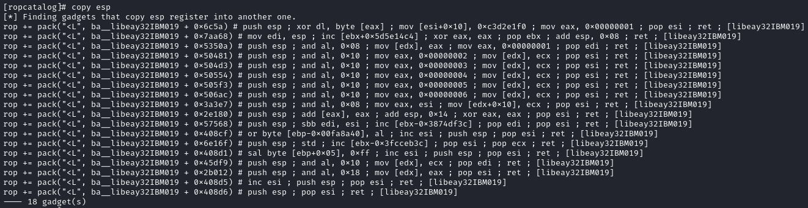
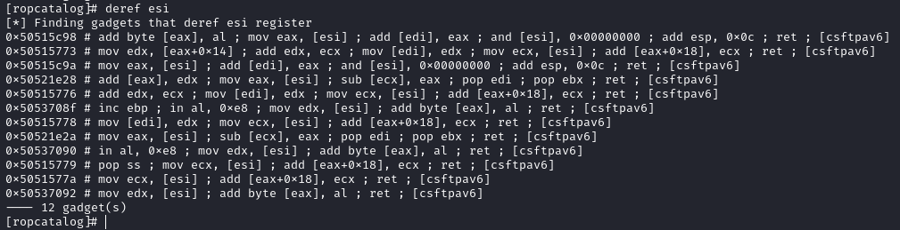
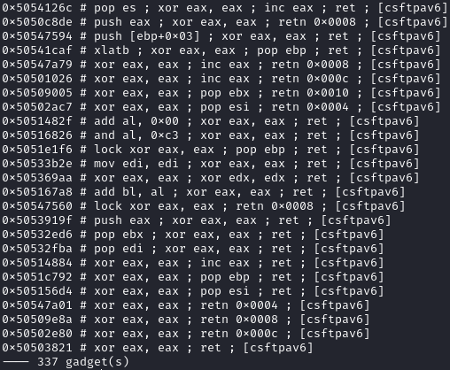

# 📖 ropcatalog

A Python tool for parsing, classifying, and browsing [ROP (Return-Oriented Programming)](https://en.wikipedia.org/wiki/Return-oriented_programming) gadgets extracted from [rp++](https://github.com/0vercl0k/rp) output files. It provides an interactive REPL with over 30 commands to search, filter, and format gadgets for Windows exploit development and binary exploitation.

<p align="center">
    
</p>

Built during an [OffSec](https://www.offsec.com/) journey, primarily for the [EXP-301](https://www.offsec.com/courses/exp-301/) and [EXP-401](https://www.offsec.com/courses/exp-401/) courses focused on Windows exploit development and [ROP chain](https://en.wikipedia.org/wiki/Return-oriented_programming) construction.

- **Gadget search**: exact, partial, regex, and semantic commands (`copy`, `pivot`, `zero`, `pop`, `syscall`, and more)
- **ASLR support**: `--offset` mode prefixes all addresses with a base variable for dynamic rebase at runtime
- **Bad character filtering**: exclude gadgets whose addresses contain bytes that break the exploit
- **Output styles**: `plain`, `python`, `cpp`, `js` for copy-paste directly into your exploit code
- **Stability filtering**: automatically removes gadgets with jumps, interrupts, or large stack shifts that would break a ROP chain
- **Multi-file**: point at a single rp++ output file or an entire directory of gadget dumps

> [!TIP]
> Use the `-c` flag to run a single command without entering the REPL. This is useful for piping gadget output directly into files or other tools.

## 📦 Installation

Prefer using [`uv`](https://docs.astral.sh/uv/), a fast Python package manager that installs tools in isolated environments. Alternatively, [`pipx`](https://pypa.github.io/pipx/) or `pip` work as well.

### With [uv](https://docs.astral.sh/uv/) (recommended)

[`uv tool install`](https://docs.astral.sh/uv/guides/tools/#installing-tools) persistently installs the tool and adds it to your `PATH`, similar to `pipx`:

**From GitHub (latest):**

```bash
uv tool install git+https://github.com/n3rada/ropcatalog.git
```

After installation, `ropcatalog` is available directly:

```bash
ropcatalog --help
```

To upgrade later:

```bash
uv tool upgrade ropcatalog
```

> [!TIP]
> You can also run `ropcatalog` **without installing** it using [`uvx`](https://docs.astral.sh/uv/guides/tools/#running-tools) (alias for `uv tool run`), which creates a temporary isolated environment on the fly:
> ```bash
> uvx --from git+https://github.com/n3rada/ropcatalog.git ropcatalog --help
> ```

### With pipx or pip

```bash
pipx install 'git+https://github.com/n3rada/ropcatalog.git'
```

```bash
pip install 'git+https://github.com/n3rada/ropcatalog.git'
```

## ⚡ Quickstart

First, dump gadgets from a target binary using [rp++](https://github.com/0vercl0k/rp):

```shell
rp-win.exe -f "C:\target\libeay32IBM019.dll" --va=0 -r 5 > libeay32IBM019.txt
```

Then, open the catalog. Use `--offset` for ASLR rebasing and `--style` for a copy-pastable output format:

```shell
ropcatalog libeay32IBM019.txt -b "\x00\x09\x0a\x0b\x0c\x0d\x20" -o -s python
```

You can also point at a directory containing multiple rp++ output files:

```shell
ropcatalog ./gadgets/ -o -s cpp
```

For scripting and piping, use `-c` to run a single command without entering the REPL:

```shell
ropcatalog fbserver.txt -c "pivot reg" > pivot_gadgets.txt
ropcatalog fbserver.txt -c "pop eax" -s python > pop_eax.py
```

## 🧸 Usage

```
ropcatalog [-h] [-b BAD_CHARACTERS] [-a] [-s {plain,python,js,cpp}] [-o] [-e ENCODING] [-c COMMAND] paths [paths ...]
```

| Flag | Description |
|------|-------------|
| `paths` | One or more rp++ output files or directories |
| `-b`, `--bad-characters` | Exclude addresses containing these bytes (e.g., `\x00\x0a\x0d`) |
| `-a`, `--all` | Disable uniqueness filtering (show all duplicate gadgets) |
| `-s`, `--style` | Output format: `plain`, `python`, `js`, `cpp` |
| `-o`, `--offset` | Prefix addresses with base address variable (for ASLR rebasing) |
| `-e`, `--encoding` | Force file encoding (auto-detected if not set) |
| `-c`, `--command` | Run a single command and exit (useful for piping output) |

## 🎮 REPL Commands

Once inside the interactive REPL, the following commands are available. Type `help` for the full list.

### 🔍 Search

| Command | Description | Example |
|---------|-------------|---------|
| `?` | Exact search | `? pop eax ; ret` |
| `/` | Partial search | `/ pop` |
| `.` | Regex search | `. mov.*rax` |
| `memoff` | Memory offset search | `memoff rbx+0x20` |

### 📝 Register Operations

| Command | Description | Example |
|---------|-------------|---------|
| `copy` | Copy register to another | `copy rax` |
| `copyto` / `mov` | Copy into register | `copyto r9` |
| `save` | Save register (no modification of either) | `save rbx` |
| `saveto` | Save into register (with mode filter) | `saveto eax imm` |
| `swap` | Swap two registers | `swap eax` |
| `zero` | Zero a register | `zero rax` |
| `inc` / `dec` | Increment/decrement register | `inc eax` |
| `add` / `sub` | Register arithmetic | `add rax rsi` |

### 💾 Memory Operations

| Command | Description | Example |
|---------|-------------|---------|
| `read` / `deref` | Read from memory pointer | `read rbx` |
| `writereg` | Write register to memory | `writereg rcx` |
| `writeptr` | Write to memory pointer | `writeptr rax` |
| `writebyte` | Write byte to pointer | `writebyte rax` |
| `addmem` / `submem` | Add/subtract memory value | `addmem rax rcx` |
| `incmem` / `decmem` | Increment/decrement memory | `incmem rax` |

### 🔀 Stack and Control Flow

| Command | Description | Example |
|---------|-------------|---------|
| `push` / `pop` | Stack push/pop | `pop rbx` |
| `ppr` | Pop-pop-ret sequences | `ppr` |
| `pivot` | Stack pivot gadgets | `pivot reg` |
| `jump` | Jump to register | `jump esp` |
| `call` | Indirect call | `call rax` |
| `transition` | Kernel-to-user transition (swapgs/iretq) | `transition` |
| `syscall` | Syscall/sysenter gadgets | `syscall` |
| `nop` / `funcnop` | NOP/functional NOP padding | `nop` |
| `loadcr` | Load control register | `loadcr rcx` |

### 🏷️ Modifiers

Append these flags to any command:

| Flag | Effect | Example |
|------|--------|---------|
| `/n` | Disable unstable operation filtering (show all gadgets) | `copyto rax /n` |
| `/v` | Filter for volatile (caller-saved) registers only | `copy rax /v` |

Both flags can be combined: `copy rax /v /n`

## 🎨 Output Styles

The `--style` flag (or `style` REPL command) controls how gadgets are formatted for copy-paste into exploits:

**Plain** (default):
```
0x10001000 # pop eax ; ret [libeay32IBM019]
```

**Python** (`-s python`):
```python
rop += pack("<L", 0x10001000) # pop eax ; ret [libeay32IBM019]
```

**C++** (`-s cpp`):
```cpp
*rop++ = 0x10001000; // pop eax ; ret [libeay32IBM019]
```

**JavaScript** (`-s js`):
```javascript
writePtr(ropBuffer + ropIndex * 8, 0x10001000); ropIndex++; // pop eax ; ret [libeay32IBM019]
```

With `--offset`, addresses are prefixed with a base address variable for ASLR rebasing:


## 🛡️ Stability Filtering

By default, `ropcatalog` filters out gadgets containing unstable operations that would break a ROP chain:

- Conditional and unconditional jumps (`jz`, `jmp`, `loop`, ...)
- Interrupts and traps (`int3`, `hlt`, `ud2`, ...)
- Privileged instructions (`cli`, `sti`, `in`, `out`, ...)
- Large `retn` values (stack shifts above 40 bytes)
- Uncontrolled `call` instructions (direct calls to addresses are filtered; indirect calls through controlled registers like `call rax` are kept)

Use the `/n` modifier to temporarily include filtered gadgets in search results.

## 📸 Screenshots

Searching for gadgets that dereference `ESI`:



Searching for gadgets that zero `EAX`:



## ⚠️ Disclaimer

**This tool is provided strictly for security research, education, and authorized penetration testing.** You must have **explicit written authorization** before running this software against any system you do not own.

This tool is designed for educational purposes only and is intended to assist security professionals during Windows exploit development courses and authorized engagements.

Acceptable environments include:
- Private lab environments you control (local VMs, isolated networks).
- Sanctioned learning platforms (CTFs, Hack The Box, OffSec exam scenarios).
- Formal penetration-test or red-team engagements with documented customer consent.

Misuse of this project may result in legal action.

## ⚖️ Legal Notice

Any unauthorized use of this tool in real-world environments or against systems without explicit permission from the system owner is strictly prohibited and may violate legal and ethical standards. The creators and contributors of this tool are not responsible for any misuse or damage caused.

Use responsibly and ethically. Always respect the law and obtain proper authorization.
