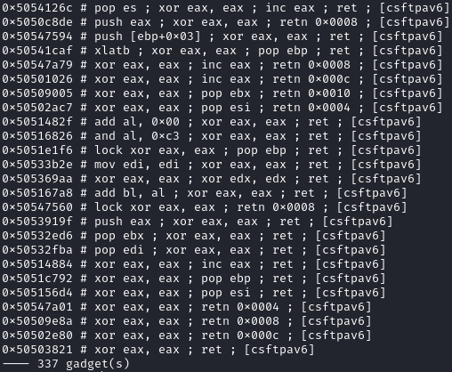

`ropcatalog` is a Python tool designed for parsing and analyzing ROP (Return-Oriented Programming) gadgets extracted from [rp++](https://github.com/0vercl0k/rp) output files. It helps identify, classify, and filter useful ROP gadgets with a primary focus on the x86 architecture.

It was built during the [EXP-301 course](https://www.offsec.com/courses/exp-301/), which focuses on exploit development. The tool is specifically tailored and designed for working with x86 ROP chains.

## Installation
Designed for simplicity:

```shell
pipx install 'git+https://github.com/n3rada/ropcatalog.git'
```

Or, without dependency conflicts:
```shell
pip install 'ropcatalog@git+https://github.com/n3rada/ropcatalog.git'
```

Then, you can directly use it by calling its name

```shell
ropcatalog ~/dump/libeay32IBM019.txt
```

## Usage Examples

Generate the output with `rp++` as follows:
```shell
.\rp-win-x86.exe -f "C:\Program Files\ibm\gsk8\lib\N\icc\osslib\libeay32IBM019.dll" --va=0 -r 5 > libeay32IBM019.txt
```
Then, open your catalog with ASLR considerations (`--offset`) and output unique (`-u`) addresses in a copy-pastable Python format (`-p`):
```shell
ropcatalog ~/dump/libeay32IBM019.txt -b "\x00\x09\x0a\x0b\x0c\x0d\x20" -u -p -o
```

```txt
[+] Bad characters: ['00', '09', '0a', '0b', '0c', '0d', '20']
[*] Parsing libeay32IBM019.txt, looking for usable gadgets

[libeay32IBM019] Parsing completed:
[+] Total gadgets extracted: 57700
[+] Gadgets excluded: 3730
   |-> 1681 gadgets had large 'retn' values
   |-> 2049 gadgets contained bad characters
[+] Total of 57700 gadgets loaded
[+] Filtered to 24974 unique gadgets based on instructions.

[ropcatalog]#
```

If you forgot how to browse your own catalog, use `help`:
```shell
[ropcatalog]# help
Available commands:
  exit  - Exit
  clear - Clear the terminal
  list  - List all gadgets
  help  - None
  ?     - Exact search for gadgets (e.g., ? pop eax ; ret)
  /     - Partial search for gadgets (e.g., / pop)
  copy  - This method finds gadgets that copy the value of a register (e.g., eax) to another register with modifcation of copied register allowed.
  save  - This method finds gadgets that copy the value of a register (e.g., eax) to another register without modifying either register afterward.
  inc   - Find gadgets that increment a register (e.g., inc eax)
  dec   - Find gadgets that decrement a register (e.g., dec eax)
  deref - Find gadgets that dereference a register (e.g., mov eax, [eax])
  re    - Search for gadgets using a regular expression pattern (e.g., re mov eax, .*)
  swap  - Find gadgets that swap given register with any other register (e.g., xchg eax, <reg>)
  zero  - Find gadgets that zero the given register
  ppr   - Find gadgets with pop-pop-ret sequences (e.g., pop eax ; pop ebx ; ret)
  jump  - Find jump-related gadgets (e.g., jmp esp, call esp, jmp [esp+0x10], etc.)
  pop   - This method finds gadgets that load a value from the stack into a specified register, typically through the pop instruction.

Modifiers:
  /n   - Disables filtering for bad operations (e.g., jump esp /n).

```

Now, you can search for any gadget that copies the stack pointer (`ESP`) register to another register:


Without offset considerations, you can search inside any module for gadgets that dereference `ESI`:


Without using the Python copy-paste format, you can search for gadgets that zero `EAX`:

